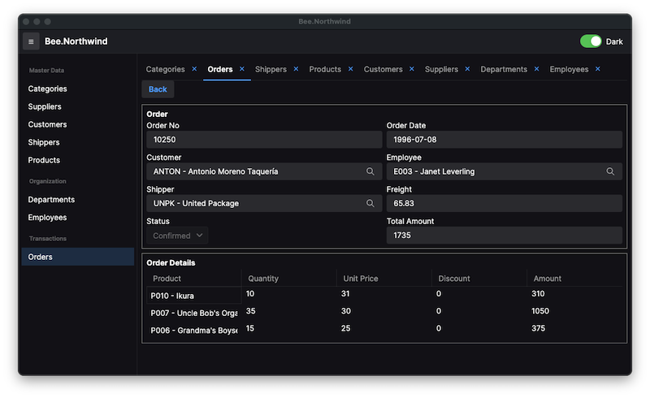
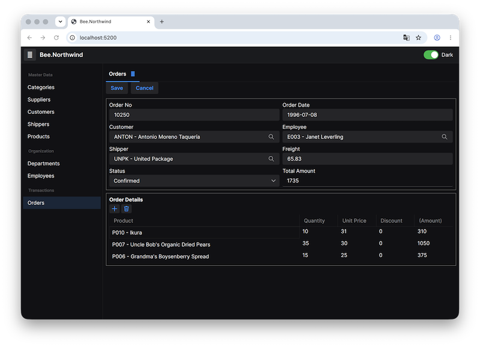
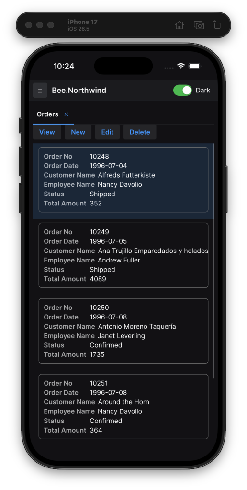
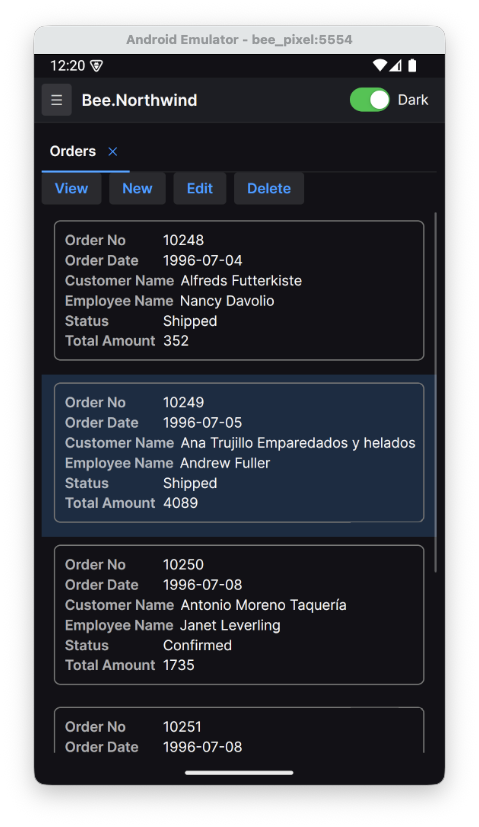
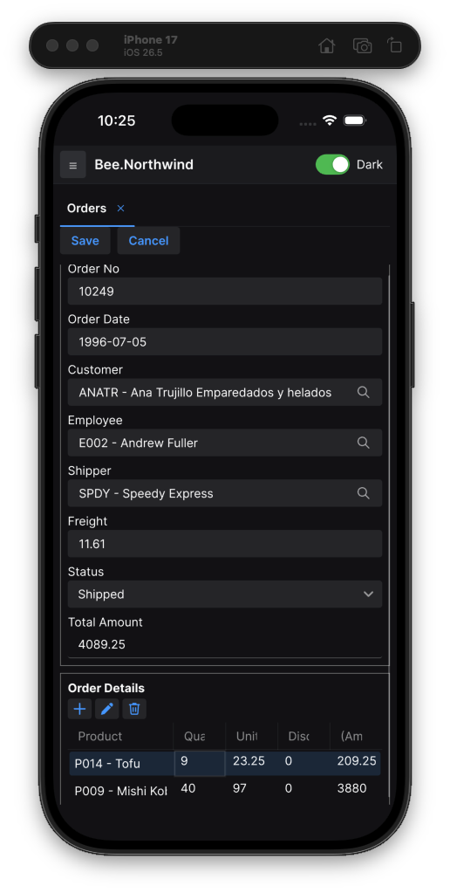
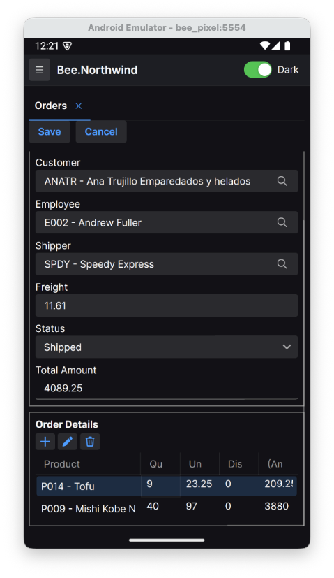

# Polhem.Northwind

**English** | [繁體中文](README.zh-TW.md)

[](https://github.com/polhem-dev/polhem-northwind/actions/workflows/build-ci.yml)

A demonstration — the classic **Northwind** inventory business case — built on the [Polhem](https://github.com/polhem-dev/polhem) framework (consumed purely as NuGet packages) to show how an application is assembled from definitions. It exists to make one argument concrete:

> **A new screen with full create / read / update / delete, list browsing, and cross-table lookups is a few XML definition files — not UI code, not CRUD code, not SQL.**

Master-data forms, master-detail orders with three lookups, framework organization tables, a per-form audit rule editor, and exactly one hand-written business object (the order rules) — everything else is definitions.

## What it demonstrates

- **Definition-driven CRUD** — `FormSchema` is the single source of truth that drives the UI form, the list view, the database table, and the validation surface.
- **Cross-table lookups with zero code** — a relation field plus a field-mapping in XML gives you a pick dialog, the foreign key, and the denormalized display columns (re-derived by a server JOIN on reload).
- **Master-detail documents** — orders carry a detail grid with per-row product lookup, saved and reloaded as one unit.
- **Declared rules, and one business-logic object for the rest** — the order's required fields and per-line amount are declared in its `FormSchema`; order numbering, status transitions, the at-least-one-line check and the order total are the *only* C# business logic in the app, in one `OrderBO`. The comparison table below shows exactly which behavior is definition, which is framework, and which is application code.
- **Framework system tables (`st_`) alongside business tables (`ft_`)** — `Employee` / `Department` are framework tables the app reuses and extends; `Customer` / `Product` / `Order` are business tables the app defines.
- **Localized captions and a tenant customization layer** — the Order form's zh-TW captions come from a language resource, and a customization layer renames two of them for this tenant while inheriting the rest. Both are definition files; neither is code.

## Running the demo

Requires the **.NET SDK 10.0.400 or later** (the analyzers in the `Polhem.Definition` package need its compiler). The database is SQLite, created and seeded on first run — no setup.

### From VS Code (recommended)

Open the repository, pick **Run Polhem.Northwind (Server + Desktop)** from the Run & Debug dropdown, and press <kbd>F5</kbd>. It builds and launches the JSON-RPC server and the desktop client together.

### From the command line

Two terminals from the repository root:

```bash
# 1. Backend (JSON-RPC on http://localhost:5100)
dotnet run --project src/Polhem.Northwind.Server

# 2. Desktop client
dotnet run --project src/Polhem.Northwind.Desktop
```

Then in the app: **Connect** (the endpoint is pre-filled) → **Sign in** with one of the two seeded accounts:

| Account | Password | Culture | What you see |
|---|---|---|---|
| `demo` | `demo` | `en-US` | English captions and formats |
| `demo-tw` | `demo` | `zh-TW` | Traditional Chinese captions (including the tenant's customized ones) and formats |

Both accounts enter the same company and see the same data; the session takes its language from the account (`st_user.culture`), not from the operating system.

### Web client (Avalonia WASM)

The same UI also runs in the browser via the **Avalonia Browser** head — the same `App`, view
models and views compiled to WebAssembly. It needs the `wasm-tools` workload
(`sudo dotnet workload install wasm-tools`) and the running server above, then:

```bash
# Web client dev server (Avalonia WASM on http://localhost:5200)
dotnet run --project src/Polhem.Northwind.Browser
```

Open <http://localhost:5200/> and connect / sign in the same way. See
[`src/Polhem.Northwind.Browser/README.md`](src/Polhem.Northwind.Browser/README.md) for the WASM-specific wiring
(localStorage endpoint, async connect, overlay dialogs, publish notes).

### Mobile clients (Avalonia iOS / Android)

The same UI also runs on iOS and Android as Avalonia single-view heads, against the same server
above. **Debug** is the convenient default below (no signing, fast iteration). Release builds keep
the SDK's default partial trimming, which Polhem supports: `Polhem.Definition` ships an
`ILLink.Descriptors.xml` that keeps the definition types `XmlSerializer` reaches by reflection.
Full trimming and NativeAOT are not supported, and a build configured for them gets the
`POLHEM9004` warning. Shipping to a physical iOS device additionally needs an Apple Developer
signing identity. The
screen reflows responsively — single-column forms and card lists on a narrow screen — and on
Android the hardware / gesture back button unwinds record → tab before exiting.

```bash
# iOS simulator (needs the ios workload + Xcode; start a simulator first)
dotnet build src/Polhem.Northwind.iOS -t:Run -f net10.0-ios -c Debug

# Android emulator (needs the Android SDK + JDK 17; start an AVD first)
dotnet build src/Polhem.Northwind.Android -t:Run -f net10.0-android -c Debug
```

On the **Android emulator** the host machine is reached at `10.0.2.2` (not `localhost`), so set the
endpoint to `http://10.0.2.2:5100/api`; the manifest enables cleartext HTTP for development. On the
**iOS simulator** use `http://localhost:5100/api` (ATS allows arbitrary loads in dev).

> The first server run creates `northwind.db` in the server project folder (`src/Polhem.Northwind.Server/`, where `.gitignore` covers it) and seeds a Northwind subset. Delete that file to reseed from scratch.
>
> The desktop and mobile heads remember the endpoint and the API key in the framework's default `FileEndpointStorage`: a per-user folder named after the head's entry assembly (for example `Polhem.Northwind.Desktop`) under the local application data directory. Where that directory is on each platform is described on `FileEndpointStorage` in `Polhem.UI.Core`. The browser head keeps them in `localStorage` instead.

## Screenshots

The same Order form rendered by all four Avalonia heads — same definitions, same controls, only the platform shell differs.

**Desktop and Browser (WASM):**

| Desktop | Browser |
|---|---|
|  |  |

**iOS and Android:**

| | iOS | Android |
|---|---|---|
| **Order list** |  |  |
| **Order detail** |  |  |

## The forms

| Menu | ProgId | Table | Layer | Highlights |
|------|--------|-------|-------|-----------|
| Categories | `Category` | `ft_category` | business | plain master, zero code |
| Suppliers | `Supplier` | `ft_supplier` | business | plain master |
| Customers | `Customer` | `ft_customer` | business | plain master |
| Shippers | `Shipper` | `ft_shipper` | business | plain master |
| Products | `Product` | `ft_product` | business | **two lookups** (Supplier + Category) |
| Departments | `Department` | `st_department` | framework system | reused framework table |
| Employees | `Employee` | `st_employee` | framework system + extension | framework fields + `title` / `hire_date`; `dept` lookup carries the department manager as supervisor |
| Orders | `Order` | `ft_order` + `ft_order_detail` | business (master-detail) | **three master lookups** (Customer / Employee / Shipper) + per-row **product lookup**; the one `OrderBO` |
| Audit Rules | `AuditRule` | `st_audit_rule` | framework system | per-form audit overrides, under Administration; framework business object |

## Framework system tables vs business tables (`st_` / `ft_`)

The table prefix records **who owns the table, not which database it lives in**:

- **`st_` — framework / system tables.** Shipped by the framework, shared across applications, relied on by framework features (permissions, organization). `Employee` (`st_employee`) and `Department` (`st_department`) are framework tables. The app copies their definitions from the framework defaults into its own `Define/` (the same way a new project is scaffolded), keeps the standard fields, and *extends* them — `Employee` adds `title` and `hire_date`.
- **`ft_` — business tables.** Defined by this application: `Category`, `Supplier`, `Customer`, `Shipper`, `Product`, `Order`, `Order Details`.

`Order → Employee` is the interesting cross-layer edge: a business table (`ft_order`) points at a framework system table (`st_employee`) — the salesperson on an order is a framework employee.

### Which database (`common` / `company` / `log`)

The prefix says who *owns* a table; a separate axis says which *database* it lives in. A `FormSchema`'s `CategoryId` selects the database scope, and it has exactly three values:

- **`company`** — per-company business data: the `ft_` tables *and* the org tables `st_department` / `st_employee` (an application's employees belong to that company). The router resolves company scope through the session's company to the company database.
- **`common`** — cross-company shared framework tables: users (`st_user`), sessions, the cache-notify signal, definition storage, companies and API keys. Not application data.
- **`log`** — the audit trail: one table each for logins, data changes, reads, and API / database anomalies. Production deployments usually give this its own database, because it grows on a different curve from business data and is read by different people.

**The two axes are orthogonal**: `st_department` / `st_employee` are framework-owned tables (`st_` prefix) that live in the **company** database, because a company's employees are that company's data. Tying "who owns it" to "where it lives" is what breaks on a multi-company deployment.

All three categories are registered in `Define/DbCategorySettings.xml`, and the seeder builds every table listed there — which is what makes adding a table pure XML.

This demo is single-company, so all three databases point at the same `northwind.db` file. **The category is what the framework routes on, so moving the audit trail (or one company) to its own database later is a change to `DatabaseSettings.xml` alone — not one form definition has to move.**

### Sign-in is two steps, and the demo takes both

Signing in answers two questions, and the framework asks them separately. `Login` answers *who you are*; `EnterCompany` answers *which company you are in*, and fills the half of the session that cannot be derived without that answer — the customization code, the roles, and the record-scope row ids. The demo has one company, so it enters it automatically right after sign-in; a deployment with several puts a chooser between the two calls and changes nothing else.

**Both steps run entirely on framework code.** The application substitutes no service and overrides no method:

- **Authentication** is the framework's own `st_user` check. The seeder writes the `demo` and `demo-tw` accounts on first start (and adds either one to an existing `northwind.db` that lacks it), with the password hashed through `PasswordHasher` at seed time (not a literal hash, which would silently stop matching the first time the hashing parameters change). Comparing an account and a password is the same operation in every deployment, so it belongs to the framework.
- **Company entry** is the framework's own `EnterCompany`. The seeder writes the matching `st_company` and `st_user_company` rows, and the call then validates the company exists and is enabled, checks the user's access, and snapshots roles and the employee context onto the session.

That `st_user` row also carries `time_zone` and `culture`, so the session takes its zone, and the client its language, from the **user** rather than from the server or a deployment default.

> **A single company is not a reason to skip the second step.** An earlier version of this demo took that shortcut — it stamped `SessionInfo.CompanyId` in an overridden `Login` instead of calling `EnterCompany` — and it cost more than it saved, in two ways that were both silent. Company-keyed lookups such as the per-form audit rules below resolve the company through `st_company`, so with no row there they returned "no rules" and every rule was ignored. And `EnterCompany` persists the company onto the `st_session` seed, which an application cannot do for itself; without it the company survived only in the cache, so a server restart handed the client back a session that authenticated but could not open a single company-scoped form.

### The audit trail, with zero application code

With auditing enabled in `SystemSettings.xml`, **every successful, failed and locked-out sign-in lands in `st_log_login` automatically**, again with no application code: the framework's own `Login` writes one record on each of those three paths. The demo sets `UseBackgroundWriter` to `false` so a record is visible the moment sign-in returns; a production host keeps the default batch writer.

**Which forms are audited is a per-form decision, not one switch for everything.** `SystemSettings.xml` sets the deployment-wide defaults — this demo records changes and does not record reads — and `st_audit_rule` overrides them one form at a time. The seeder writes three rows to make the mechanism visible: `Order` and `Customer` turn read logging **on** against the deployment default and mark their entries sensitive; `Category` turns change logging **off**, because reference data churn is noise in an audit trail. Every other form carries no row and simply inherits. The rules live in the company database and are edited through the **Audit Rules** form under Administration.

> The demo's copy of `AuditRule.FormSchema.xml` drops the `PermissionModelId` that the framework ships, because Northwind has no permission infrastructure at all and enforcement is fail-closed — keeping it would make the form impossible to open. **A real deployment keeps it** and grants the model to an administrator role: anyone who can edit these rules can decide what is and is not recorded.

## Northwind → polhem model mapping

Northwind is a normalized relational schema; polhem is a `sys_rowid` (Guid) relation model. The demo borrows Northwind's business case and data, but the keys and relations follow polhem conventions:

| Northwind | polhem convention |
|-----------|----------------|
| text / int primary key (`CustomerID='ALFKI'`, `ProductID=17`) | `sys_id` (string business code) + `sys_rowid` (Guid relation key) + `sys_no` (auto-increment) |
| name column (`CompanyName`, `ProductName`) | `sys_name` |
| foreign key (`Orders.CustomerID`) | `customer_rowid` (Guid) + `RelationProgId="Customer"` + field mappings that fill `ref_customer_id` / `ref_customer_name` |
| composite-key detail (`Order Details`: OrderID+ProductID) | `sys_rowid` PK + `sys_master_rowid` (→ Order) + `product_rowid` (lookup → Product) + quantity / price |
| employees | framework `st_employee`: framework fields + Northwind data columns; the manager comes from the department, not a `ReportsTo` self-relation |

## What is definition, what is framework, what is application code

This is the whole argument in one table.

| Behavior | Source | Where |
|----------|--------|-------|
| Form layout, field editors, labels | **definition** | `FormLayout`, one stored file per form (`FormLayoutGenerator` drafts it from the `FormSchema` at design time); labels from the `FormSchema` |
| List columns and browsing | **definition** | `FormSchema.ListFields` |
| Database table + indexes | **definition** | `TableSchema` |
| Insert / update / delete dispatch | **framework** | `FormBusinessObject` + repository |
| Lookup dialog, foreign key write-back, JOIN reload | **definition + framework** | relation field + `RelationFieldMappings`; framework `GetLookup` |
| Master-detail save as one unit | **framework** | repository, driven by the multi-table `FormSchema` |
| Order's required fields and per-line amount | **definition** | `Order.FormSchema.xml`: `Rules` (`FormRule`) and a `ValueExpression` field |
| progId to business-object and repository binding | **definition** | `ProgramSettings.xml` (the type registry) |
| Navigation menu (grouped form list) | **definition** | `MenuSettings.xml` |
| Localized captions and display names | **definition** | `Define/Language/{lang}/{progId}.Language.xml` |
| Per-tenant caption overrides | **definition** | `Customize/{customizeId}/Language/…`, resolved per key |
| Login / session / encryption | **framework** | `SystemBusinessObject`, API pipeline |
| **Order number, status transitions, at-least-one-line check, order total** | **application code** | `OrderBO` (the only business logic in the app) |

The single C# business object, [`OrderBO`](src/Polhem.Northwind.Server/BusinessObjects/OrderBO.cs), overrides `GetNewData` and `DoBeforeSave` to add what a generic form cannot express. Its pure rules are factored into [`OrderRules`](src/Polhem.Northwind.Server/BusinessObjects/OrderRules.cs) and [`OrderDataSet`](src/Polhem.Northwind.Server/BusinessObjects/OrderDataSet.cs), kept free of database dependencies and separate from the orchestration.

Its two database queries live in [`IOrderRepository`](src/Polhem.Northwind.Server/Repositories/IOrderRepository.cs) / [`OrderRepository`](src/Polhem.Northwind.Server/Repositories/OrderRepository.cs), bound to the *same* registry entry as the business object — one progId, one business object, one repository. That is the style template for a form that needs data access beyond the generated CRUD: extend `IDataFormRepository` rather than replace it, derive from `DataFormRepository`, and let the business object ask for it by interface (`CreateFormRepository<IOrderRepository>()`). Keeping the SQL out of the business object is also what let these two queries route to the order's own company database instead of the one the business object happened to name.

## Localization and the tenant customization layer

The Order form is captioned twice over. `FormSchema` carries the English captions inline, so
English needs no resource file at all — a missing key leaves the schema's own text in place.
`Define/Language/zh-TW/Order.Language.xml` supplies the zh-TW captions, keyed by the same
convention everywhere (`Schema.DisplayName`, `Table.{table}.DisplayName`, `Field.{field}.Caption`).
Sign in as `demo-tw` to see them: the session's culture comes from that account's `st_user` row.

Which language a client shows is the signed-in **account's** culture: `Login` returns the
`st_user.culture` value, and `ClientInfo.ApplyLoginResult` makes it the client's UI culture. The
seeded `demo` account is `en-US` (`NorthwindCredentials.Culture`), so it opens in English; the
seeded `demo-tw` account is `zh-TW` (`NorthwindCredentials.ZhTwCulture`). To see the zh-TW captions
and the tenant's caption overrides below, sign out and sign in as `demo-tw`.

On top of that sits the customization layer. The demo company names a customization code
(`NorthwindCredentials.CustomizeId`), the session picks it up at sign-in, and every definition
lookup then consults `Customize/{customizeId}/` before the packaged `Define/` tree. This tenant
calls its customers 經銷商, so its zh-TW resource declares exactly two keys:

```xml
<LanguageItem Key="Field.customer_rowid.Caption" Value="經銷商" />
<LanguageItem Key="Field.ref_customer_name.Caption" Value="經銷商名稱" />
```

Everything else on the form still resolves against the packaged resource — **language text is
overridden per key, not per file** — so a caption the package adds later reaches this tenant
without touching its customization. Layouts and menus work the opposite way (whole file wins),
because a partial merge of a visual arrangement has no intuitive answer. This tenant uses that too:
`Customize/northwind-demo/FormLayout/Order.FormLayout.xml` replaces the packaged Order layout and
leaves the salesperson, shipper and freight off the master block.

Two independent things gate the layer, and clearing either returns the demo to a plain packaged
deployment with no other change: the session's customization code, and `PathOptions.CustomizePath`
in [`NorthwindBackend`](src/Polhem.Northwind.Server/NorthwindBackend.cs). Companies map many-to-one onto
a customization code, so one code shared by many companies is the normal arrangement — the demo
just happens to have one of each.

Assembling all of this is the client's job, not the server's: the APIs serve definitions exactly
as stored, and `FormDefinitionLoader` fetches both layers, applies the overlay, and hands the view
a localized schema. One switch covers the whole client — `ClientInfo.UseDefinitionLoader`, on by
default and set explicitly in [`App.axaml.cs`](src/Polhem.Northwind.UI/App.axaml.cs) — and the record
form, the list and the lookup dialog all use `ClientInfo.DefinitionLoader`. With it off,
a view renders the definitions as stored: English captions, and the packaged layout from
`Define/FormLayout/` instead of the tenant's.

## Closing chapter: add a Region form in 30 minutes, with zero code

Northwind has a `Region` table the demo leaves out — so you can add it yourself. You will add **definition files and settings entries only, no code**, then restart and get a fully working CRUD screen.

### 1. The table — `Define/TableSchema/company/ft_region.TableSchema.xml`

A region is business data, so it goes in the **company** category (`TableSchema/company/`), alongside the other `ft_` tables.

```xml
<?xml version="1.0" encoding="utf-8"?>
<TableSchema xmlns:xsi="http://www.w3.org/2001/XMLSchema-instance" xmlns:xsd="http://www.w3.org/2001/XMLSchema" TableName="ft_region" DisplayName="Region">
  <Fields>
    <DbField FieldName="sys_no" Caption="Sequence" DbType="AutoIncrement" />
    <DbField FieldName="sys_rowid" Caption="Row ID" DbType="Guid" />
    <DbField FieldName="sys_id" Caption="Region Code" DbType="String" Length="20" />
    <DbField FieldName="sys_name" Caption="Region Name" DbType="String" Length="50" />
  </Fields>
  <Indexes>
    <DbTableIndex Name="pk_{0}" Unique="true" PrimaryKey="true">
      <IndexFields><IndexField FieldName="sys_no" /></IndexFields>
    </DbTableIndex>
    <DbTableIndex Name="rx_{0}" Unique="true">
      <IndexFields><IndexField FieldName="sys_rowid" /></IndexFields>
    </DbTableIndex>
    <DbTableIndex Name="uk_{0}" Unique="true">
      <IndexFields><IndexField FieldName="sys_id" /></IndexFields>
    </DbTableIndex>
  </Indexes>
</TableSchema>
```

### 2. The form — `Define/FormSchema/Region.FormSchema.xml`

```xml
<?xml version="1.0" encoding="utf-8"?>
<FormSchema xmlns:xsi="http://www.w3.org/2001/XMLSchema-instance" xmlns:xsd="http://www.w3.org/2001/XMLSchema" ProgId="Region" DisplayName="Region" CategoryId="company" ListFields="sys_id,sys_name">
  <Tables>
    <FormTable TableName="Region" DbTableName="ft_region" DisplayName="Region">
      <Fields>
        <FormField FieldName="sys_no" Caption="Sequence" DbType="AutoIncrement" Visible="false" />
        <FormField FieldName="sys_rowid" Caption="Row ID" DbType="Guid" Visible="false" />
        <FormField FieldName="sys_id" Caption="Region Code" DbType="String" />
        <FormField FieldName="sys_name" Caption="Region Name" DbType="String" />
      </Fields>
    </FormTable>
  </Tables>
</FormSchema>
```

### 3. The layout — `Define/FormLayout/Region.FormLayout.xml`

The file is named after the progId, not the table. The runtime renders this file and **fails when it is absent** — it does not derive a layout from the `FormSchema`. `FormLayoutGenerator` (or **Generate FormLayout** in the DefineEditor tool) drafts one from the schema at design time; the result is saved and edited like any other definition.

```xml
<?xml version="1.0" encoding="utf-8"?>
<FormLayout xmlns:xsi="http://www.w3.org/2001/XMLSchema-instance" xmlns:xsd="http://www.w3.org/2001/XMLSchema" LayoutId="Region" ProgId="Region" Caption="Region">
  <Sections>
    <LayoutSection Name="Main" Caption="Region">
      <Fields>
        <LayoutField FieldName="sys_id" Caption="Region Code" />
        <LayoutField FieldName="sys_name" Caption="Region Name" />
      </Fields>
    </LayoutSection>
  </Sections>
</FormLayout>
```

### 4. Register the table — add to the company category in `Define/DbCategorySettings.xml`

```xml
<TableItem TableName="ft_region" DisplayName="Region" />
```

This is what makes the seeder build the table on the next start (it builds every table registered here, into the database the category maps to).

### 5. Optionally, register the program — add to `Define/ProgramSettings.xml`

```xml
<ProgramItem ProgId="Region" DisplayName="Regions" />
```

`ProgramSettings.xml` is the type registry: it maps a progId to the types bound to it — a business object and a repository. A progId with no entry, or an entry without those attributes, gets the framework default (`FormBusinessObject` and the default form repository), so Region works without this line; declaring it keeps the registry a complete list of the programs. Here only `Order` binds its own types, and `AuditLog` names the framework's audit-log business object.

### 6. Put it on the menu — add to `Define/MenuSettings.xml`

```xml
<MenuEntry Id="region" Caption="Regions" Order="60" ProgId="Region" />
```

Add it inside the `master-data` folder. `Id` is the node key and must be unique across the whole menu tree; it is separate from `ProgId` so the same program can appear in more than one place.

### 7. Restart

Restart the server (it creates `ft_region`) and the desktop client. **Regions** is now in the left menu under Master Data, with working list, new, edit, delete, and a unique-code check from the `uk_` index — all from definition edits, no compilation of your own code.

## Project layout

```
polhem-northwind/
├── Define/                       definitions — the source of truth (no project, read by the server)
│   ├── FormSchema/               one form per file
│   ├── FormLayout/               one stored layout per form
│   ├── TableSchema/{common,company,log}/  one folder per category
│   ├── SystemSettings.xml        deployment settings (auditing, security keys, defaults)
│   ├── CurrencySettings.xml      currencies and their rounding
│   ├── DatabaseSettings.xml      the common + company + log databases
│   ├── DbCategorySettings.xml    which tables exist, per category (drives schema build)
│   ├── ProgramSettings.xml       the type registry (progId to business object + repository)
│   ├── MenuSettings.xml          the navigation menu (folders, order, captions)
│   └── Language/{lang}/          localized captions, one file per progId
├── Customize/{customizeId}/      the tenant customization layer (same shape as Define/; holds only what it overrides)
└── src/
    ├── Polhem.Northwind.Server/      JSON-RPC backend, OrderBO, JSON seed data
    ├── Polhem.Northwind.UI/          Avalonia shared UI (views, view models, navigation)
    ├── Polhem.Northwind.Desktop/     desktop entry point (Avalonia.Desktop)
    ├── Polhem.Northwind.Browser/     web entry point (Avalonia WASM)
    ├── Polhem.Northwind.iOS/         iOS entry point (Avalonia.iOS)
    └── Polhem.Northwind.Android/     Android entry point (Avalonia.Android)
```
